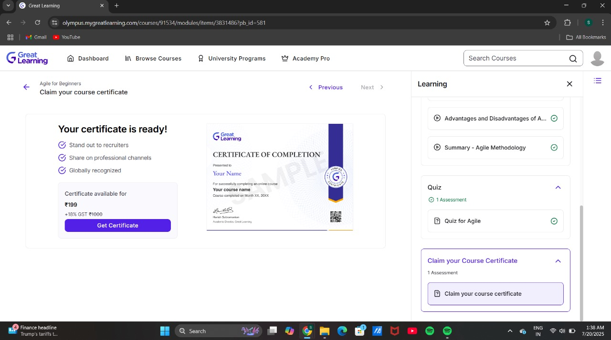
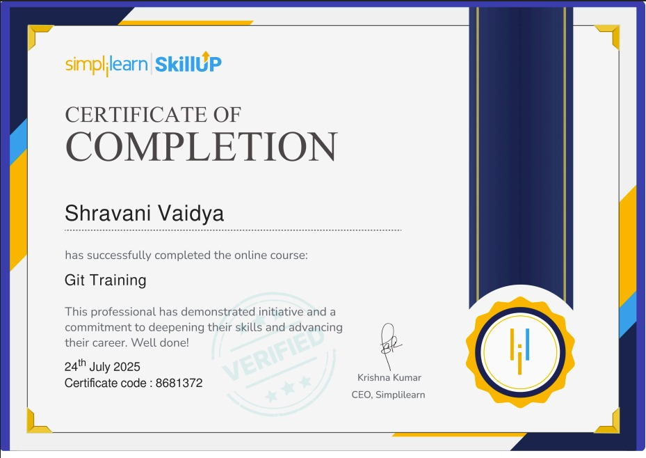
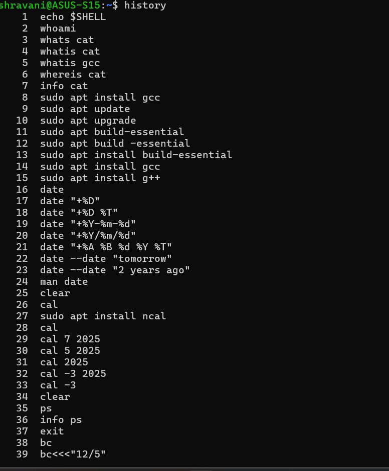
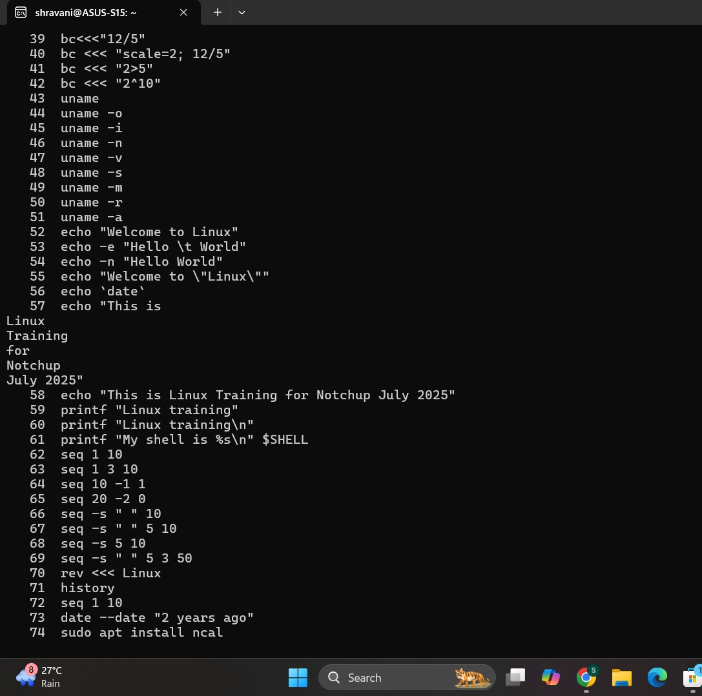
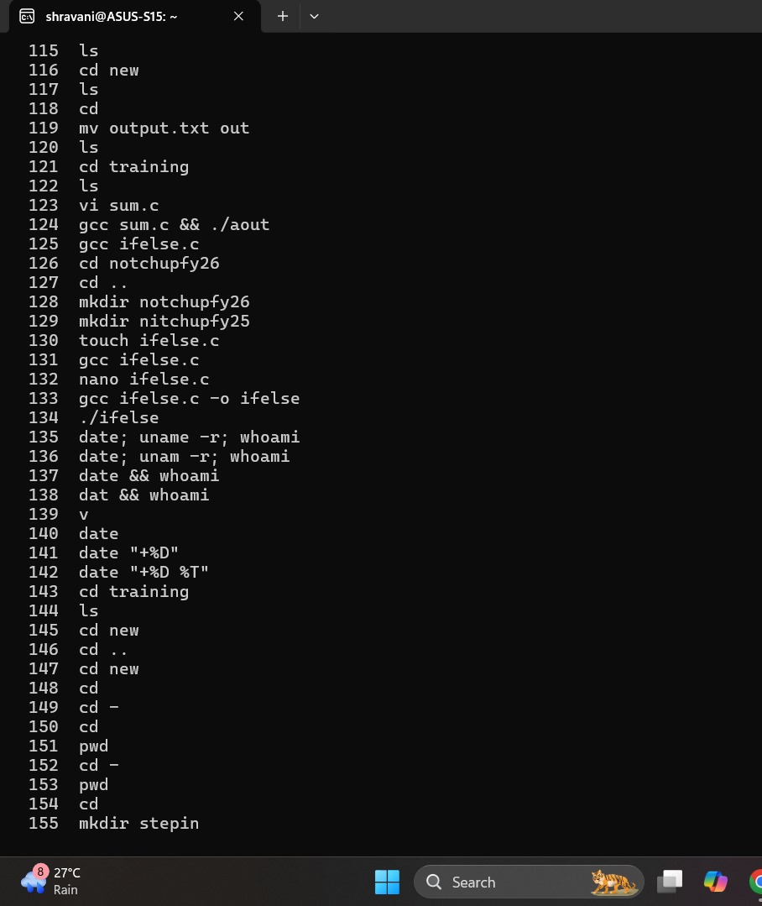
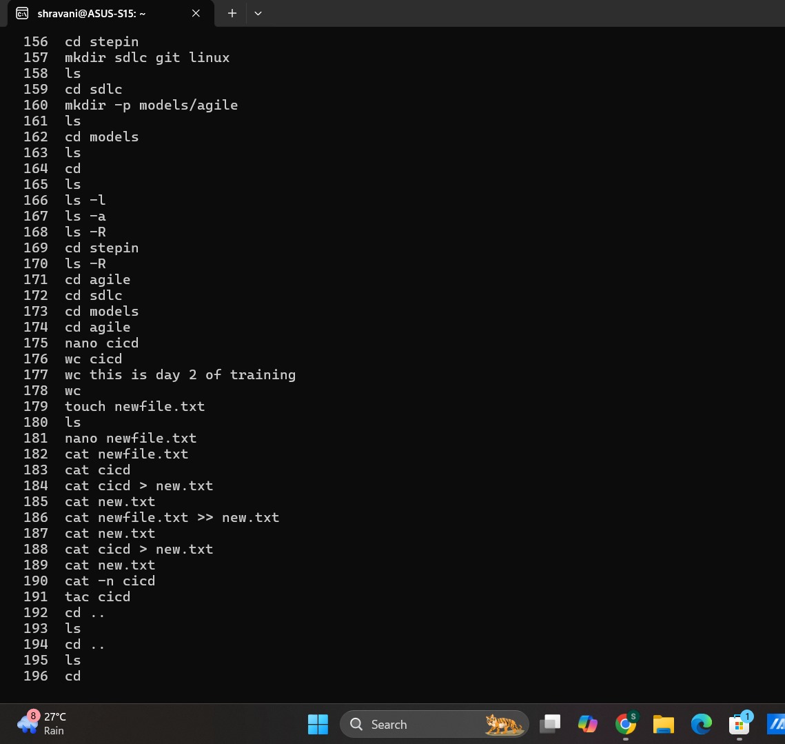
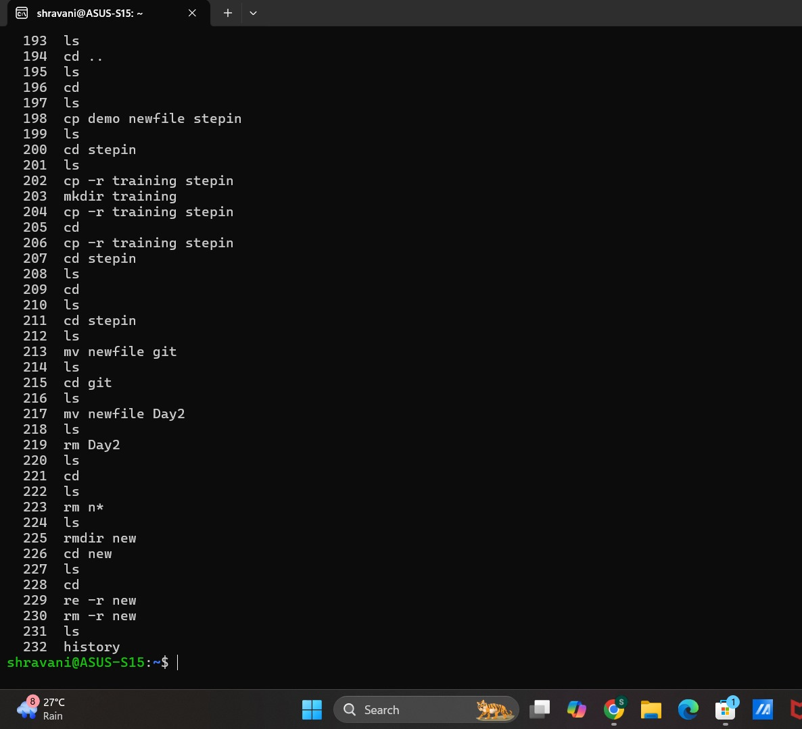
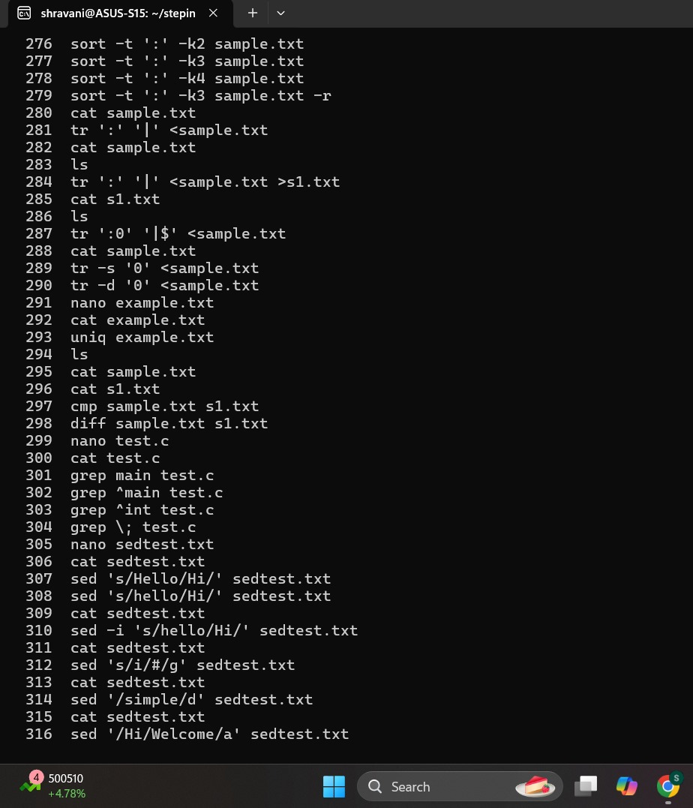
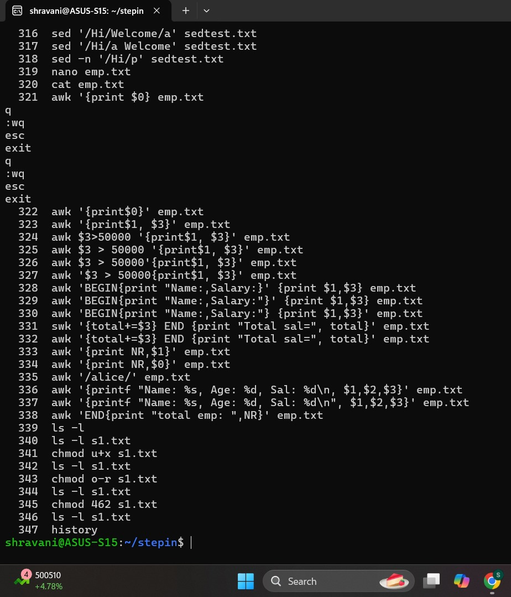

# 5189762_Shravani Vaidya

## AGILE CERTIFICATE

## SIMPLILEARN CERTIFICATE

  

## LINUX TRAINING

## ASSIGNMENT-1

### Screenshot 1

### Screenshot 2

### Screenshot 3

### Screenshot 4

### Screenshot 5

### Screenshot 6

## ASSIGNMENT 2

### Screenshot 7

### Screenshot 8

### Screenshot 9

## C PROGRAMMING CERTIFICATES

### Solo-learn Beginner Certificate

### Solo-learn Intermediate Certificate

